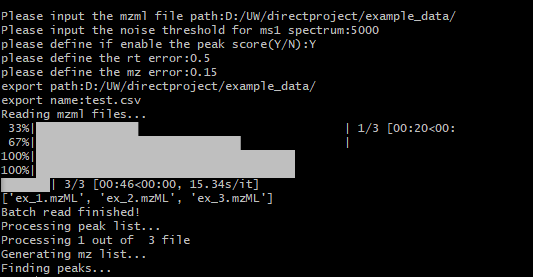
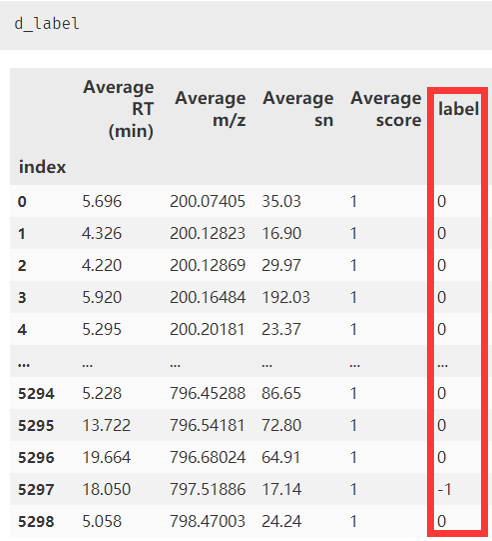
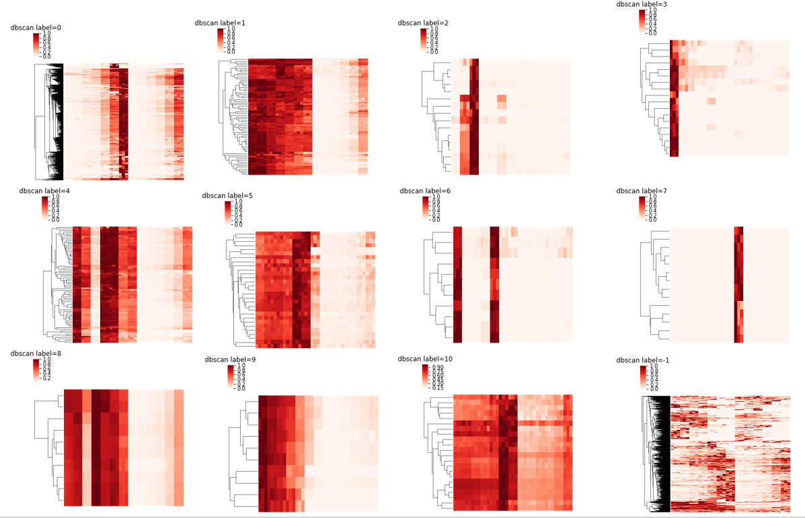
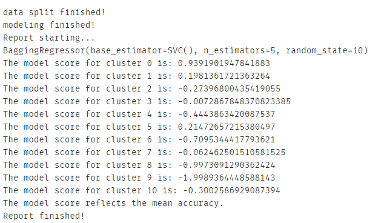
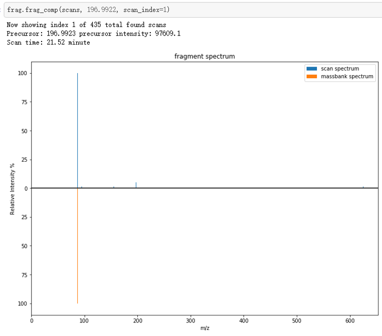

# mass-suite   

[](https://travis-ci.com/XiminHu/mass-suite)
[](https://coveralls.io/github/XiminHu/mass-suite?branch=master)
[](https://img.shields.io/github/license/XiminHu/mass-suite)
[](https://img.shields.io/github/stars/XiminHu/mass-suite)
[](https://img.shields.io/github/forks/XiminHu/mass-suite)

[](https://img.shields.io/pypi/pyversions/pandas)
[](https://img.shields.io/github/issues/XiminHu/mass-suite)
[](https://img.shields.io/librariesio/github/XiminHu/mass-suite)
[](https://img.shields.io/github/repo-size/XiminHu/mass-suite?color=pink)
[](https://img.shields.io/github/last-commit/XiminHu/mass-suite)

This package is initiated from the University of Washington eScience capstone project.

## Mass-suite: Comprehensive Mass Spectrometry(MS) data analysis tool

Mass-suite is a package used for general MS data process and advanced data analysis.

It provided a full capacity including data import, alignment, noise removal, visualization and fragment searching using online database.

The mass-suite package is also providing a data mining option for the feature clustering using dilution datasets, aiming at dilution prediction, source tracking and matrix effect assessment.

#### Contributers: Ximin Hu, Derek Mar, Nozomi Suzuki, Bowei Zhang
#### Release date: 

## Installation & major dependencies
#### Activating the virtual environment
* Included within the root of the repository is a virtual environment
pre-suited to run `mss`
  * The virtual environment is located within environment.yml
  * To create the virtual environment from the .yml file:
  `conda env create -f environment.yml`
  * To activate the virtual environment:
  `conda activate mss`

Mass-suite requires major dependencies:

* Pandas 1.0.3 or higher
* Numpy 1.16.5 or higher
* Scikit-learn 0.23.0 or higher
* Scipy 1.4.1 or higher
* [pymzml](https://github.com/pymzml/pymzML) 2.4.6 or higher
* [plotly](https://plotly.com/) 4.5.2 or higher

Optional dependencies for machine-learning models:
* Keras 2.3.1 
* Tensorflow 2.0.0
* Pytorch 1.4.0 or higher

Please make sure the major dependencies are up to date before the installation.

The package can be installed & imported as following:
```
pip install mass-suite
```
```
from mass-suite import *
```


## Organization of the project
The project has the following major structure:
   
   
    mass-suite/
      |- mss/
         |- __init__.py
         |- alignment.py
         |- dm.py
         |- frag.py
         |- mssdata.py
         |- mssmain.py
         |- version.py
         |- visreader.py
         |- *.pkl
         |- tests/
            |- __init__.py
            |- test_*.py
         |- dev/  
            |- *.ipynb
      |- script/
         |- mss_processor.py
      |- doc/
      |- example_data/
      |- README.md
      |- LICENSE
      |- environment.yml

## Featured modules

### MS data import and alignment

Supported formats:
* .mzml

MS data will be imported and filtered to create a dataframe in readable format from the mzml file.

A random forest model is integrated in the function as optional assessing tool for peak quality assessment.


Data from different experiments will be aligned together according to user defined error range. 

Supported export formats: .csv/.xlsx


There is also a script version of the functions that integrated the functions into a automated workflow, please see ```script/mss_processor.py```

The automated workflow is excutable via command line:

```python -m mss_processor.py```

example:



Currently the script only support *.csv* export.

### MS data analysis

Supported formats: formats supported by Pandas

This is a data analysis module using cluster algorithm to find grouping features, detecting noises and mining for dilution prediction/source tracking.

ms_cluster function will grouping the features into clusters using selected algorithm. Dimension reduction and cluster report are optional within the function settings.

Current clustering algorithms:
* [DBSCAN](https://scikit-learn.org/stable/modules/generated/sklearn.cluster.DBSCAN.html)
* [OPTICS](https://scikit-learn.org/stable/modules/generated/sklearn.cluster.OPTICS.html)
* Non-parametric hypothesis test (please refer to trend_calc function)

example output:



cluster report output:



After clustering, modeling function is provided to predict the dilution rate from samples and catch the behavior of individual clusters

```feature_model(d_transpose, cluster_algorithm=True, model_method='ensemble_bagging_svc', report=True)```

User can define either to use all features for modeling or individual clusters for modeling

Currently supporting models: linear regression, random forest regression, ensemble bagging regression

Model assessment report is also optional upon function settings:



User can use the model and cluster information for new sample prediction:

 

Simple source identification tool is also incorporated in this module:


Please refer to function documentation for more details.

### MS data visualization & interactive plots(extended work)

[Example for TIC plot](./doc/pic/tic-test.html)

### Molecule identification using fragment information (extended work)

All the online searching is using [MoNA MassBank database](https://mona.fiehnlab.ucdavis.edu/).



## Project Data

All the data used in the project is giving credit to [Center of Urban Water](https://www.urbanwaters.org/).

#### Reference: 
	Application of Nontarget High Resolution Mass Spectrometry Data to Quantitative Source Apportionment
	Katherine T. Peter, Christopher Wu, Zhenyu Tian, and Edward P. Kolodziej
	Environmental Science & Technology 2019 53 (21), 12257-12268
	DOI: 10.1021/acs.est.9b04481


## Model training and testing

All the data used for model training is under 'example_data' folder and can be repeatly trained by users according to the settings.

## Testing and continuous integration

The majority of code is tested under unittest and pushed through [travis CI](https://travis-ci.com/github/XiminHu/mass-suite).

## Licensing

The package is open source and can be utilized under MIT license. Please find the detail in `licence` file.

## Call for contributions

Mass-suite welcomes help from wide range of different backgrounds. As the package will keep developing, suggestions and improvements are always appreciated. If you are interested in testing the package using your own MS data, giving suggestions for adding modules or improving existing ones, have some question or seeking for cooperation, please contact the main contributor(xhu66@uw.edu).

### Special Thanks
  * A big shout to Professor Dave Beck, Professor Edward Kolodziej, Katherine Peter, and the Center of Urban Water for all of their help during the development of this package.

